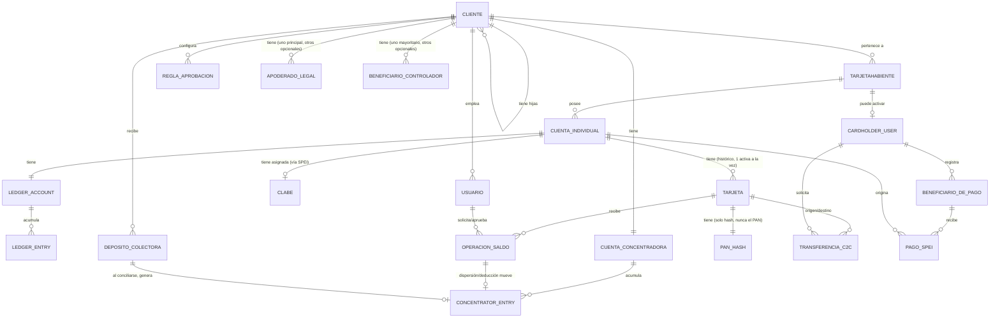

# Modelo de dominio — KBM

> Referencia viva. Última revisión: 2026-09-24. El esquema real vive en
> `backend/migrations/0001_init.sql` — si este documento y el esquema
> divergen, el esquema manda y este documento debe corregirse.

## Jerarquía y entidades principales

## Notas de lectura

- **Cliente → Cliente** es una relación reflexiva: cada Cliente puede tener
  un `parent_client_id`. La visibilidad es unidireccional (el padre ve a
  sus descendientes, nunca al revés) y todos los roles del padre heredan
  el mismo alcance sobre las hijas (ver `roles-and-permissions.md`).
- **Ledger_entry es append-only**: no existe operación de UPDATE/DELETE a
  nivel de base de datos (trigger `ledger_entries_no_update`) — cualquier
  corrección se modela como un nuevo movimiento compensatorio, nunca como
  edición del historial.
- **`CUENTA_INDIVIDUAL`**, desde `docs/adr/0020-cuenta-individual-tarjetahabiente.md`:
  el saldo dejó de vivir en `TARJETA` — vive aquí. Nace al dar de alta al
  Tarjetahabiente (no al asignarle una tarjeta), tiene 1:1 su propio
  `LEDGER_ACCOUNT`, y puede tener varias `TARJETA` a lo largo del tiempo
  pero como máximo una `active` a la vez (ver "Reemplazo de tarjeta" en
  `docs/business/tarjetas-y-asignacion.md`). No confundir con
  `CUENTA_CONCENTRADORA`/`DEPOSITO_COLECTORA` (esas son del *Cliente*,
  esta es del *Tarjetahabiente*) — tres "cuentas" distintas conviven en
  el dominio, cada una con su propio dueño y propósito.
- **Operación de saldo** es la única vía para mover el ledger de una
  Cuenta Individual — no hay escritura directa a `ledger_entries` fuera
  del flujo de aprobación. Desde que existe la Cuenta Concentradora
  (`docs/business/tesoreria-cliente.md`), una Dispersión/Deducción
  también escribe un `concentrator_entry` del lado del Cliente — misma
  regla de append-only, misma operación, dos ledgers.
- **Concentrator_entry también es append-only** — mismo patrón que
  `ledger_entry`, un `concentrator_account` es 1:1 con un Cliente (no con
  una Tarjeta).
- Dos planos de identidad separados: `USUARIO` (staff: Super Admin, Admin
  Cliente, Operador, Auditor) vs. `CARDHOLDER_USER` (autoservicio del
  Tarjetahabiente) — ver `docs/security/data-classification.md` para el
  porqué de la separación. Un `TARJETAHABIENTE` existe siempre (lo crea
  el staff); su `CARDHOLDER_USER` correspondiente solo existe si ya se
  activó el portal de autoservicio — de ahí la relación opcional (`o|`).
- **`PAN_HASH`** es un almacén separado, no una columna más de `TARJETA`
  — guarda solo un hash irreversible (HMAC) del PAN completo, nunca el
  PAN en claro, usado exclusivamente para resolver el destino de una
  `TRANSFERENCIA_C2C`. Ver
  `docs/adr/0009-pan-hash-transit-for-c2c-transfers.md`.
- **`TRANSFERENCIA_C2C`** es una entidad separada de `OPERACION_SALDO`
  a propósito, aunque ambas terminan escribiendo `LEDGER_ENTRY` — la
  solicita un `CARDHOLDER_USER` (no un `USUARIO` de staff), nunca pasa
  por `REGLA_APROBACION`, y nunca toca `CUENTA_CONCENTRADORA`. Ver
  `docs/business/autoservicio-tarjetahabiente.md`.
- **`CLIENTE.is_active`** ya existía en el esquema, pero desde
  2026-09-17 tiene comportamiento real: desactivar un Cliente se
  propaga en cascada a **todos** sus descendientes, y bloquea cualquier
  acción operativa dentro de ese alcance (no solo la visibilidad) — ver
  `docs/business/desactivacion-de-clientes.md`.
- **`TARJETAHABIENTE.is_active`**, desde 2026-09-18: desactivar a un
  Tarjetahabiente **no** es simétrico como la cascada de Cliente —
  bloquea de inmediato (`blocked`) sus tarjetas sin bloqueo previo, pero
  reactivar no las desbloquea automáticamente (requiere una acción manual
  por tarjeta). Tampoco permite editar su expediente mientras está
  inactivo (a diferencia de Cliente, que sí). Ver
  `docs/business/desactivacion-de-tarjetahabientes.md`.
- **`TARJETA.blocked_reason`**, desde 2026-09-18: distingue si una
  tarjeta `blocked` lo está por acción manual del staff (`manual`) o
  automáticamente por la desactivación de su Tarjetahabiente
  (`cardholder_inactive`) — el segundo caso no puede desbloquearse
  mientras el Tarjetahabiente siga inactivo, sin importar el rol de quien
  lo intente. Ver `docs/business/tarjetas-y-asignacion.md`, "Motivo de
  bloqueo".
- **`BENEFICIARIO_DE_PAGO`** (desde `docs/adr/0021-conector-spei.md`) es
  una CLABE externa a la que un `CARDHOLDER_USER` puede pagar vía SPEI —
  **no confundir con `BENEFICIARIO_CONTROLADOR`** (ver el siguiente punto):
  son dos conceptos de "beneficiario" completamente distintos que
  coexisten a propósito con nombres distintos para no colisionar. Sigue
  siendo alta/edición 100% del propio `CARDHOLDER_USER` (nadie de staff
  lo crea en su nombre), pero desde
  `docs/adr/0022-reportes-staff-y-visibilidad-beneficiarios.md` staff sí
  puede **verlo** dentro de su alcance jerárquico normal — no introduce
  ninguna entidad ni relación nueva, es una corrección de visibilidad
  sobre esta misma tabla.
- **`APODERADO_LEGAL` y `BENEFICIARIO_CONTROLADOR`** son expedientes KYB
  del Cliente mismo (persona moral), no relacionados con `TARJETAHABIENTE`
  (persona física que usa una tarjeta) ni con `USUARIO` (quien opera la
  consola) — son tres roles de persona completamente distintos que
  pueden coincidir o no en la vida real. Cada Cliente en la jerarquía
  (raíz o filial) tiene su propio expediente completo, sin heredar del
  padre — cada filial es su propia entidad legal. Ver
  `docs/business/kyb-cliente.md`.
