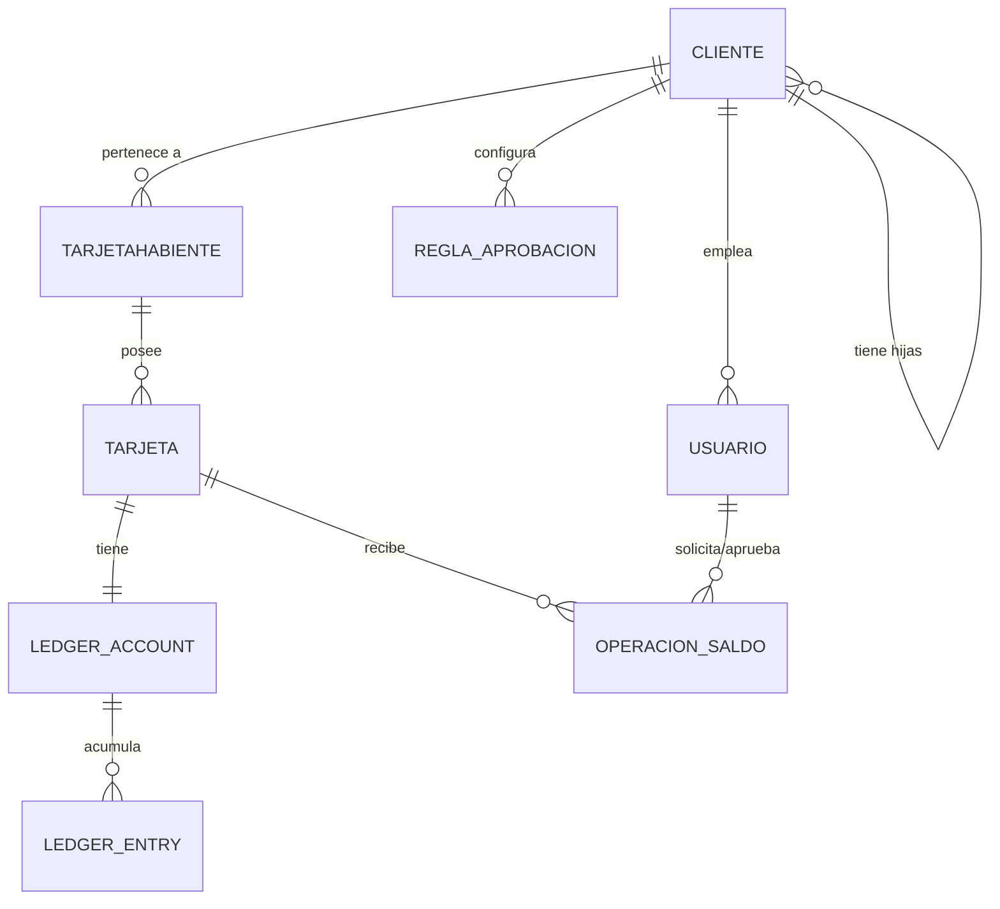

# Modelo de dominio — KBM

> Referencia viva. Última revisión: 2026-09-15. El esquema real vive en
> `backend/migrations/0001_init.sql` — si este documento y el esquema
> divergen, el esquema manda y este documento debe corregirse.

## Jerarquía y entidades principales

## Notas de lectura

- **Cliente → Cliente** es una relación reflexiva: cada Cliente puede tener
  un `parent_client_id`. La visibilidad es unidireccional (el padre ve a
  sus descendientes, nunca al revés) y todos los roles del padre heredan
  el mismo alcance sobre las hijas (ver `roles-and-permissions.md`).
- **Ledger_entry es append-only**: no existe operación de UPDATE/DELETE a
  nivel de base de datos (trigger `ledger_entries_no_update`) — cualquier
  corrección se modela como un nuevo movimiento compensatorio, nunca como
  edición del historial.
- **Operación de saldo** es la única vía para mover el ledger — no hay
  escritura directa a `ledger_entries` fuera del flujo de aprobación.
- Dos planos de identidad separados: `USUARIO` (staff: Super Admin, Admin
  Cliente, Operador, Auditor) vs. `cardholder_users` (autoservicio del
  Tarjetahabiente) — ver `docs/security/data-classification.md` para el
  porqué de la separación.
