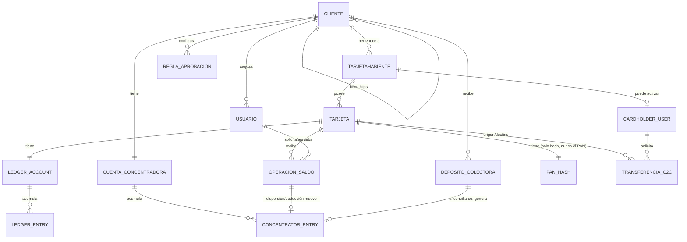

# Modelo de dominio — KBM

> Referencia viva. Última revisión: 2026-09-15. El esquema real vive en
> `backend/migrations/0001_init.sql` — si este documento y el esquema
> divergen, el esquema manda y este documento debe corregirse.

## Jerarquía y entidades principales

## Notas de lectura

- **Cliente → Cliente** es una relación reflexiva: cada Cliente puede tener
  un `parent_client_id`. La visibilidad es unidireccional (el padre ve a
  sus descendientes, nunca al revés) y todos los roles del padre heredan
  el mismo alcance sobre las hijas (ver `roles-and-permissions.md`).
- **Ledger_entry es append-only**: no existe operación de UPDATE/DELETE a
  nivel de base de datos (trigger `ledger_entries_no_update`) — cualquier
  corrección se modela como un nuevo movimiento compensatorio, nunca como
  edición del historial.
- **Operación de saldo** es la única vía para mover el ledger de una
  tarjeta — no hay escritura directa a `ledger_entries` fuera del flujo
  de aprobación. Desde que existe la Cuenta Concentradora
  (`docs/business/tesoreria-cliente.md`), una Dispersión/Deducción
  también escribe un `concentrator_entry` del lado del Cliente — misma
  regla de append-only, misma operación, dos ledgers.
- **Concentrator_entry también es append-only** — mismo patrón que
  `ledger_entry`, un `concentrator_account` es 1:1 con un Cliente (no con
  una Tarjeta).
- Dos planos de identidad separados: `USUARIO` (staff: Super Admin, Admin
  Cliente, Operador, Auditor) vs. `CARDHOLDER_USER` (autoservicio del
  Tarjetahabiente) — ver `docs/security/data-classification.md` para el
  porqué de la separación. Un `TARJETAHABIENTE` existe siempre (lo crea
  el staff); su `CARDHOLDER_USER` correspondiente solo existe si ya se
  activó el portal de autoservicio — de ahí la relación opcional (`o|`).
- **`PAN_HASH`** es un almacén separado, no una columna más de `TARJETA`
  — guarda solo un hash irreversible (HMAC) del PAN completo, nunca el
  PAN en claro, usado exclusivamente para resolver el destino de una
  `TRANSFERENCIA_C2C`. Ver
  `docs/adr/0009-pan-hash-transit-for-c2c-transfers.md`.
- **`TRANSFERENCIA_C2C`** es una entidad separada de `OPERACION_SALDO`
  a propósito, aunque ambas terminan escribiendo `LEDGER_ENTRY` — la
  solicita un `CARDHOLDER_USER` (no un `USUARIO` de staff), nunca pasa
  por `REGLA_APROBACION`, y nunca toca `CUENTA_CONCENTRADORA`. Ver
  `docs/business/autoservicio-tarjetahabiente.md`.
